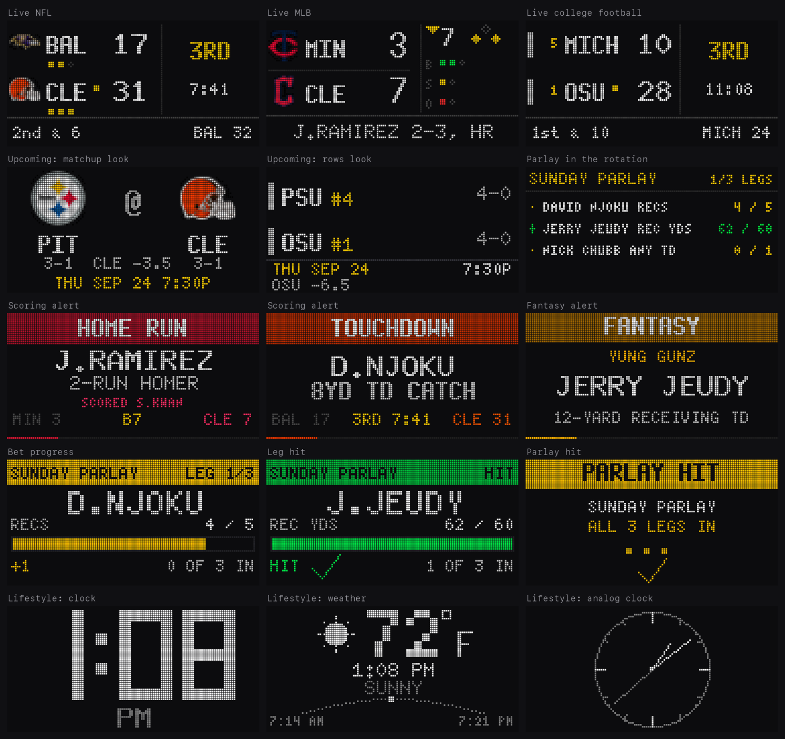
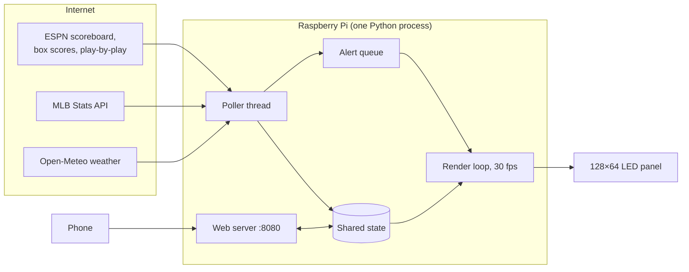

# LED Sportsbug

A portable 128×64 LED scoreboard for live NFL, MLB and college football. It also
tracks your bets and fantasy players on the same screen. Everything runs on a
Raspberry Pi Zero 2 behind two 64×64 LED panels, and you control it from a web
page on your phone. Nothing to install on the phone, no account, no API keys.



**What it does**

- **Live score bugs** for NFL, MLB and college football: score, clock, down and
  distance, red zone, count, outs, runners on base, rankings and team logos.
- **Scoring alerts** that take over the screen for your favourite teams, and
  say who scored and how (`J.RAMIREZ · 2-RUN HOMER · SCORED S.KWAN`).
- **Bet tracking**: player props and parlays, each with a progress bar that
  updates play by play. A card appears when a leg moves or hits, then a
  `PARLAY HIT` card when the whole ticket lands.
- **Fantasy alerts** when one of your starters scores or makes a big play,
  labelled with your team name.
- **Upcoming games** with kickoff time and the betting spread, when nothing
  is live.
- **Lifestyle mode**: a clock, the weather, a message, countdowns, or a custom
  dashboard, for when it isn't game day.
- **Broadcast delay**, so the panel never spoils a play before your TV shows it.
- **Portable**: at a new house it starts its own Wi-Fi hotspot, and you join
  the local network from your phone.

---

## Contents

1. [Parts](#parts)
2. [Wiring and power](#wiring-and-power)
3. [Install on the Pi](#install-on-the-pi)
4. [Using it](#using-it)
5. [How it works](#how-it-works)
6. [Troubleshooting](#troubleshooting)
7. [Running it on a laptop](#running-it-on-a-laptop-no-hardware)
8. [Project layout](#project-layout)

---

## Parts

| Part | What to get | Notes |
|---|---|---|
| LED panels | 2× **P3 64×64 RGB HUB75** (1/32 scan, FM6126A driver chip) | Chained side by side into one 128×64 display, 384 × 192 mm |
| Computer | **Raspberry Pi Zero 2 WH** | Any Pi with a 40-pin header works, except the Pi 5, which the LED driver doesn't support. The Zero 2 is plenty. |
| HUB75 adapter | **SEENGREAT RGB Matrix Adapter Rev 3.0** | Sits between the Pi header and the panel ribbon. Adafruit HATs also work (see [Tuning](#tuning)). |
| Panel power | **5 V, 10 A** supply | Two panels draw up to 4 A each at full white |
| Pi power | Its own **5 V, 2.5 A** USB supply | Don't share it with the panels. See below. |
| Storage | 8 GB+ microSD | |
| Cables | The HUB75 ribbons and power harness that come with the panels | |

## Wiring and power

```
 Pi Zero 2 ──► HUB75 adapter ──ribbon──► Panel 1 IN   Panel 1 OUT ──ribbon──► Panel 2 IN
     ▲                                        ▲                                    ▲
 5V 2.5A USB                                  └──────── 5V 10A supply ─────────────┘
```

- The panels are daisy-chained. Data goes into panel 1 and out to panel 2. The
  arrows printed on the back of each panel show the data direction.
- 64-row panels use an **E address line**. Set the adapter's E jumper as its
  documentation describes, or the bottom half of the panel mirrors the top.
- **Power the Pi separately.** When the panels light up, their sudden current
  draw pulls the shared 5 V rail below what the Pi needs, and the Pi resets. A
  bigger shared supply doesn't fix this. A separate supply does. Check with
  `vcgencmd get_throttled` on the Pi: `0x0` means the power is clean.

---

## Install on the Pi

About 30 minutes, most of it the Pi compiling on its own.

### 1. Flash the SD card

Use [Raspberry Pi Imager](https://www.raspberrypi.com/software/) and choose
**Raspberry Pi OS (64-bit) Lite**, Bookworm or newer. The code needs Python
3.10 or later.

Before writing, open **Edit settings** (the OS customisation screen) and set:

| Setting | Value |
|---|---|
| Hostname | `sportsbug` |
| Username / password | `sportsbug` / a password of your choice. The commands below assume this username. |
| Wi-Fi | your home network name and password, plus your **Wi-Fi country** |
| Services | **Enable SSH**, password authentication |

### 2. Install

Put the card in the Pi, connect the panel, and power both on. Wait a minute or
two for the first boot, then from a computer on the same network:

```bash
ssh sportsbug@sportsbug.local
```

Then on the Pi:

```bash
sudo apt update && sudo apt install -y git
git clone https://github.com/reese-hannam/LED-Sportsbug.git ~/led-sports-bug
cd ~/led-sports-bug
sudo bash deploy/install-pi.sh
```

The installer:

1. checks the power supply
2. adds swap so the compile doesn't run out of memory
3. installs system packages
4. names the Pi `sportsbug`
5. creates the Python environment
6. downloads the team logos
7. builds the LED driver ([hzeller/rpi-rgb-led-matrix](https://github.com/hzeller/rpi-rgb-led-matrix))
8. frees the hardware timer the panel needs, and reserves a CPU core for it
9. runs a self-check
10. installs the service that starts the panel on boot

**If your SSH connection drops, the install keeps going.** Run the same
command again to reconnect to it. If the Pi restarts partway through, run it
again and it picks up from the last finished step.

When it's done:

```bash
sudo reboot
```

### 3. Check the panel lights

```bash
sudo ~/led-sports-bug/.venv/bin/python ~/led-sports-bug/tools/paneltest.py
```

You should see red, green, blue and white, then a one-pixel border around the
whole display. If the border wraps or doubles, the panel settings are wrong
(see [Tuning](#tuning)). If the panel stays black, see
[Troubleshooting](#troubleshooting).

### 4. Open the control center

From now on it starts by itself whenever it has power. On your phone, on the
same Wi-Fi:

**http://sportsbug.local:8080**

Some Android phones can't open `.local` addresses. If yours can't, use the
Pi's IP address instead. Your router's device list shows it, or run
`hostname -I` on the Pi.

### Updating

```bash
cd ~/led-sports-bug && git pull && sudo systemctl restart sportsbug
```

If `requirements.txt` changed, also run `.venv/bin/pip install -r requirements.txt`
before the restart.

---

## Using it

Everything is set from the control center. Your settings are saved on the Pi
in `config.json` and survive restarts.

| Tab | What's there |
|---|---|
| **Main** | Which sports to show; upcoming games (rows or matchup layout, and whether they cycle while other games are live); seconds per screen, brightness, team logos; broadcast delay |
| **Panel** | The games in rotation right now. Pin one to hold it on screen, or skip ahead. College football categories (Top 25, conferences) go here too. |
| **Lifestyle** | Clock styles, weather for a place you enter, a message, countdowns, custom dashboards. Switch the panel to it with **LIFE** at the top of the page. |
| **Bets** | Add player props, group them into parlays, and choose whether bets get their own screens in the rotation |
| **Fantasy** | Your fantasy teams and starters, and which kinds of alert they trigger |
| **Setup** | Wi-Fi networks, alert length, **Test popup** and **Run demo**, favourite teams, and NFL game replays |

**Run demo** plays a two-minute scripted show of the main features: three live
games, a home run, a touchdown, two fantasy alerts, and a parlay landing leg by
leg. It's useful for filming or checking a new build. Your real games, bets and
settings come back when it ends.

`http://sportsbug.local:8080/tv` shows the panel full-screen in a browser, for
a laptop or tablet.

### Bets

Pick a game, a player and a stat, then enter the **goal**: the number that
wins. *Over* means that many or more (`5+ receptions`). *Under* means that
many or fewer (`≤ 1 interception`). If you type a sportsbook line like `4.5`,
it's rounded to the goal it means (`5+`). **Anytime TD** needs no number: a
rushing or receiving touchdown by that player hits it. Combined stats like
*rush + rec yards* are available where the sport has them.

Put two or more bets in a **parlay** and they play as a group. When one play
moves several legs, you see one card per leg, then the whole ticket if it's
complete. A parlay's cards all play before the next parlay's. The parlay also
gets its own screen in the rotation. You can turn that screen off in Bets.

### Taking it somewhere new

At a new house the panel won't know the Wi-Fi. After about 45 seconds it
starts its own hotspot and shows these instructions on the panel:

1. On your phone, join the Wi-Fi network **`SPORTSBUG`** (password `scoreboard`).
2. Open **http://10.42.0.1:8080**, go to **Setup → Scan for networks**, pick
   the house Wi-Fi and enter its password.
3. The panel leaves the hotspot and joins that network, so your phone
   disconnects. That's expected. Rejoin the house Wi-Fi and open
   `sportsbug.local:8080` again.

It remembers every network it joins, so next time it connects by itself. If a
join fails, the panel shows why (wrong password or out of range) and brings
the hotspot back.

---

## How it works



It's one Python process with three parts:

- **Poller** (`app/main.py`) fetches scores for each active sport on its own
  schedule, so a slow college fetch never holds up baseball. During an NFL game
  it also reads the play-by-play feed every few seconds. Games go into the
  shared state (`app/state.py`), and anything worth interrupting for goes into
  the alert queue.
- **Render loop** draws one frame 30 times a second. It never waits on the
  network. It draws whatever the state holds, rotating through the games (plus
  bet screens), or the lifestyle screens, and puts the current alert on top.
- **Web server** (`app/web/`, FastAPI) serves the control center: a single
  HTML page that reads and changes the same state.

**Plays become "moments."** A single play can cause several alerts: the score,
a parlay leg, a straight bet, a fantasy touchdown. `app/moments.py` groups them
into one **moment** that plays in a fixed order: the score, then each parlay
leg by leg, then straight bets, then fantasy. The queue (`app/alerts.py`) plays
each moment through without interruption, so alerts from different plays
don't interleave. If a backlog builds up, the least important moments are
dropped first.

**Bet stats are counted play by play.** ESPN's box score can lag a play by a
minute or more, so NFL stats are tallied directly from each play
(`app/sources/nfl_playstats.py`) and checked against the box score as it
catches up. The tally is deliberately cautious: when a play is unclear (a
penalty, a fumble, a two-point try) it counts less rather than more. Counting
too much could show a false `LEG HIT`. Across eight recorded games it matched
the official box score on 99% of player stats, and it never counted more than
the official total.

**Broadcast delay.** Streaming TV often runs 30 seconds or more behind real
time. `app/delay.py` holds everything back by the delay you set: scores, bet
progress and alerts. The panel then lines up with what you're watching instead
of spoiling it.

**Hardware.** `app/matrix.py` uses the real LED driver when it's installed,
and a browser emulator otherwise. The rest of the code doesn't know which one
it's talking to. The panel's hardware settings are read from
`/etc/default/sportsbug` (see [Tuning](#tuning)).

**Wi-Fi.** `app/wifi.py` manages networks through NetworkManager. It remembers
networks, starts the setup hotspot when none are in range, and handles joining
from the control center.

**Data sources.** Scores and stats come from ESPN's and MLB's public web
endpoints. These are unofficial and could change without notice. Weather comes
from [Open-Meteo](https://open-meteo.com), which is free and needs no key.
None of them need an account.

### Tuning

The panel's hardware settings live in `/etc/default/sportsbug` (installed from
[`deploy/sportsbug.env`](deploy/sportsbug.env)). App updates never overwrite it.

| Setting | Default | Change it when |
|---|---|---|
| `MATRIX_PANEL_TYPE` | `FM6126A` | Your panels use ordinary driver chips. Set it empty. |
| `MATRIX_MAPPING` | `regular` | You use an Adafruit HAT: `adafruit-hat`, or `adafruit-hat-pwm` with the GPIO4–GPIO18 jumper soldered |
| `MATRIX_SLOWDOWN` | `2` | Raise it if the panel sparkles or ghosts. A Pi 4 usually wants `4`. |
| `MATRIX_ROWS` / `COLS` / `CHAIN` | `64` / `64` / `2` | You use a different panel size or number of panels |

```bash
sudo nano /etc/default/sportsbug
sudo systemctl restart sportsbug
```

---

## Troubleshooting

| Symptom | Cause and fix |
|---|---|
| **Panel completely black, no errors** | Almost always the driver chip. FM6126A panels ignore all data until they get a startup sequence, and the log shows no error either way. Check `MATRIX_PANEL_TYPE` first, then the ribbon direction (into panel 1's **IN**), then panel power. |
| Bottom half mirrors the top | The adapter's E-line jumper isn't set for 64-row panels |
| Sparkles, ghosting or flicker | Raise `MATRIX_SLOWDOWN` |
| Pi reboots when the panel lights up | Shared power supply. Give the Pi its own. `vcgencmd get_throttled` should read `0x0`. |
| `sportsbug.local` doesn't open | Make sure the phone is on the same Wi-Fi. On Android, use the Pi's IP address (`hostname -I` on the Pi, or your router's device list). |
| Panel says `NO WIFI` | It's in hotspot mode. See [Taking it somewhere new](#taking-it-somewhere-new). |
| No logos, just color bars | The logo download failed during install. Run `.venv/bin/python tools/fetch_logos.py`. |
| Something else | Run `journalctl -u sportsbug -f` to follow the log, and `.venv/bin/python tools/selfcheck.py` to test the software |

Commands on the Pi:

```bash
journalctl -u sportsbug -f             # follow the log
sudo systemctl restart sportsbug       # restart the panel
sudo systemctl stop sportsbug          # stop it (e.g. to run paneltest.py)
```

---

## Running it on a laptop (no hardware)

You can run the whole thing on a laptop with no hardware. The panel appears in
a browser tab instead. This is the easiest way to try it or work on the code.
Tested on macOS and Linux with Python 3.10+.

```bash
git clone https://github.com/reese-hannam/LED-Sportsbug.git
cd LED-Sportsbug
python3 -m venv .venv
.venv/bin/pip install -r requirements-dev.txt
.venv/bin/python tools/fetch_logos.py
./start.sh
```

- Control center: **http://localhost:8080**
- The panel itself: **http://localhost:8888**

To copy your changes from the laptop to the Pi:

```bash
./deploy/push.sh          # copies the code, restarts the panel
./deploy/push.sh --code   # faster: skips the logos and fonts
```

The script connects to `sportsbug@sportsbug.local` by default. For a different
username or hostname, run `PI=user@host ./deploy/push.sh`.

**Replaying real games.** `tools/record_nfl.py` saves a finished NFL game.
You can then replay it as if it were live, which is how the bet and fantasy
alerts can be tested outside of game day:

```bash
.venv/bin/python tools/record_nfl.py --year 2025 --seasontype reg --week 1
./start.sh --mode nfl --replay <game id> --speed 8
```

**Self-check.** `tools/selfcheck.py` renders every screen, checks the settings
file, the bet and alert logic, and the demo, and times a frame. Run it after
any change.

---

## Project layout

```
app/
  main.py            poller, render loop, startup
  state.py           shared state and settings
  alerts.py          alert queue
  moments.py         groups one play's alerts into one ordered moment
  bets.py            props, parlays, goals
  bet_events.py      bet alert cards
  fantasy*.py        fantasy rosters and alerts
  delay.py           broadcast delay
  demo.py            the Run demo script
  wifi.py            networks and the setup hotspot
  matrix.py          real panel or emulator
  sources/           ESPN, MLB and weather data, play-by-play parsing
  render/            everything drawn on the panel, one file per screen
  web/               control center (server.py + static/index.html)
assets/fonts/        BDF bitmap fonts
assets/logos/        team logos (downloaded at install; add your own in _custom/)
deploy/              Pi installer, systemd service, panel settings, push script
tools/               panel test, self-check, logo download, game recorder, preview
```

---

## Credits

- [hzeller/rpi-rgb-led-matrix](https://github.com/hzeller/rpi-rgb-led-matrix): the
  LED driver. The installer downloads and builds it on the Pi. The BDF fonts in
  `assets/fonts` come from the same project.
- [RGBMatrixEmulator](https://github.com/ty-porter/RGBMatrixEmulator): the
  browser panel for running without hardware.
- [Open-Meteo](https://open-meteo.com): weather.

This project isn't affiliated with or endorsed by the NFL, MLB, the NCAA,
ESPN or any team. Team names and logos belong to their owners. The logo
files aren't included in this repository. Your Pi downloads them at install.
